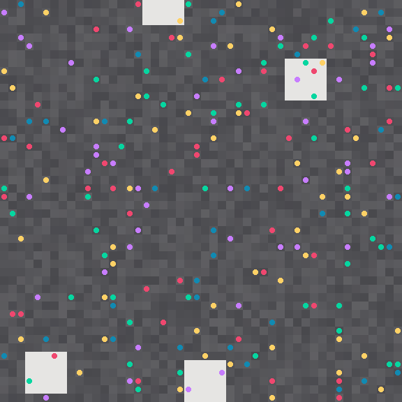
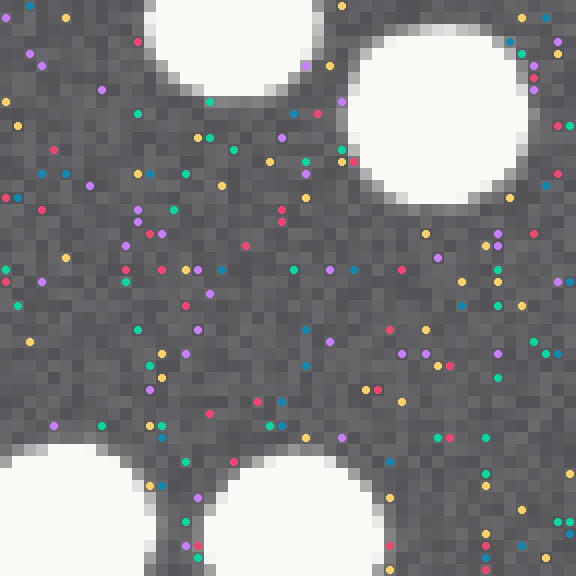
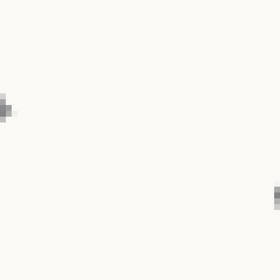

# Gentrification Painter 🎨 → ⬜

> The grid is a neighborhood. Cheap studios (grey) slowly become expensive
> galleries (white). Artists (colored dots) get pushed out when `rent > income`.
> Watch the art disappear.

A tiny cellular-automata painting about displacement — the whole economy is
**~40 lines in `js/automata.js`**.

 

**Live:** https://maanas-pab.github.io/gentrification-painter/

| studios (t=0, 220 artists)                                                  | tipping point (t=35, 166 left)                                                  | galleries (t=120, 0 left)                                            |
| --------------------------------------------------------------------------- | ------------------------------------------------------------------------------- | -------------------------------------------------------------------- |
|  |  |  |

## Run it

No build. Just open it:

```bash
npx serve . -l 3000
# → http://localhost:3000
```

Or double-click `index.html` (CDN needs internet for p5.js).

## How it works

```
rent[x,y] += rich_neighbours × pressure × (0.4 + rent) + drift
artist displaced if rent[x,y] > income
```

- `js/automata.js` — rent-spread CA core (the 40-liner)
- `js/sketch.js` — p5 rendering + artists + displacement
- `js/controls.js` — presets, pressure slider, sparkline, CSV export
- `data/presets.json` — SoHo / Kreuzberg / Hyper neighborhoods
- `docs/STATEMENT.md` — artist statement

## Controls

| Control      | What it does                                                |
| ------------ | ----------------------------------------------------------- |
| Neighborhood | SoHo (slow), Kreuzberg (tipping point), Hyper (flashover)   |
| Pressure     | Gentrification speed. Crank it = rezoning event             |
| Space / R    | Pause / re-seed (keyboard)                                  |
| CSV          | Downloads `displacement-log.csv` (x, y, rent, income, tick) |

Live stats: **% gentrified**, **artists left**, **displaced**, plus an
artists-alive sparkline.

## Data

Every displacement is logged to `window.__events` and exportable as CSV.
Typical Hyper run empties ~180 artists in under 2 minutes. SoHo holds out
3–4× longer — pressure is everything.

## Format

```bash
npm run format        # prettier --write .
npm run format:check  # CI check
```

## License

MIT © 2026 Maanas Pabbathi. See [LICENSE](LICENSE).
See [docs/STATEMENT.md](docs/STATEMENT.md) for the why.
